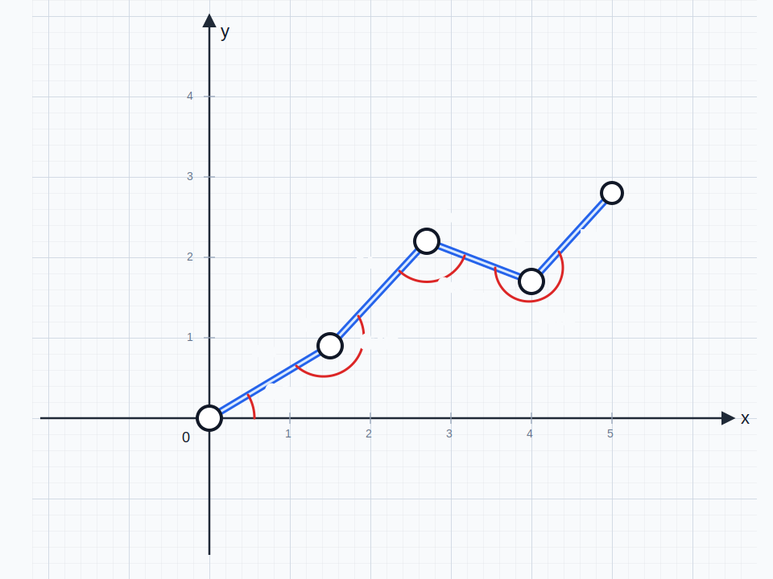
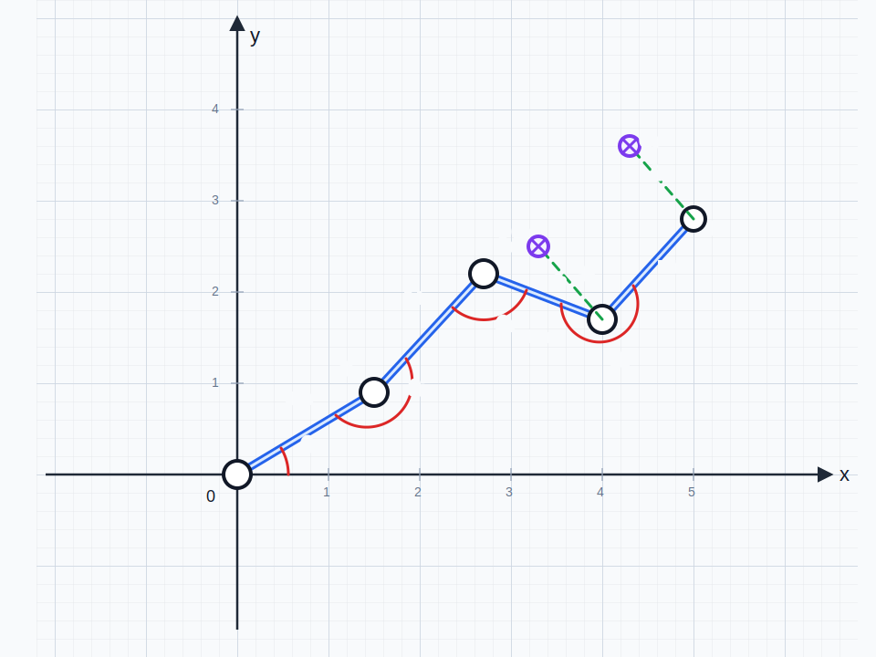

# manipulator-ml-control

## Решение при помощи задачи регрессии

### Постановка задачи

#### 2D-случай
Пусть манипулятор имеет $n$ сочленений. Обозначим вектор углов поворота сочленений манипулятора: $\Theta = (\theta_1,\theta_2,\dots,\theta_n)\in\mathbb{R}^n$ и вектор пар координат сочленений: $J = (J_1,J_2,\dots,J_n)\in(\mathbb{R}\times\mathbb{R})^n,\ J_m=(x_m,y_m)$. Функция для решения прямой кинематики для робота с заранее заданными длинами звеньев: $f_{fk}: \mathbb{R}^n \to (\mathbb{R}^2)^n,\ J=f_{fk}(\Theta)$.

Обозначим также целевые точки $G_m$, в которые должны прийти определённые сочленения робота (не все, а, например, только конечные). Индексы $I\subseteq\{1,\dots,n\}$ соответствуют номерам сочленений, к которым относятся целевые точки: $G_m=(x_m^\ast,y_m^\ast)\in\mathbb{R}^2,\ m\in I$. И расстояния между целевыми точками и сочленениями: $l_m(\Theta)=\|J_m(\Theta)-G_m\|_2,\ m\in I,\ L=\{l_m\mid m\in I\}$. Если $m,m+1\in I$, то $\|G_{m+1}-G_m\|_2=d_m$, где $d_m$ — длина звена между $J_m$ и $J_{m+1}$. 

Решение задачи регрессии будет заключаться в минимизации функции суммы расстояний:

$$
f_{dist}: \mathbb{R}^n \to \mathbb{R},\quad
$$
$$
f_{dist}(\Theta)=\sum_{i\in I}\|(f_{fk}(\Theta))_i-G_i\|_2^2=\sum_{i\in I}((f_{fk}(\Theta))_i - G_i)^T((f_{fk}(\Theta))_i - G_i)
$$
$$
\Theta^\ast=\arg\min_{\Theta\in\mathbb{R}^n} f_{dist}(\Theta)
$$
